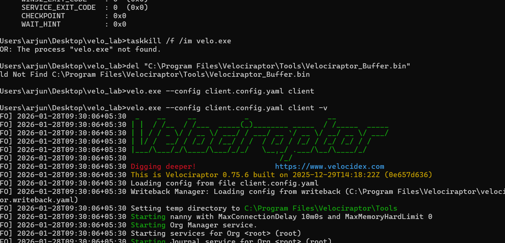

# velociraptor-DFIR-Lab
🚀 Endpoint Threat Hunting Lab: Velociraptor DFIR
📌 Overview
This project demonstrates a real-time Digital Forensics and Incident Response (DFIR) workflow. I deployed a Velociraptor server on Ubuntu 24.04 and connected a Windows 11 endpoint to perform live forensic artifact collection and threat hunting.
The primary goal was to investigate Persistence Mechanisms (MITRE ATT&CK T1053) by auditing scheduled tasks to identify potential backdoors, malicious scripts, or unauthorized automation.
🛠️ Tech Stack & Lab Setup
Server: Ubuntu 24.04 (Linux)
Client: Windows 11 (Endpoint)
Tool: Velociraptor (Open-source DFIR & Endpoint Monitoring)
Artifacts Analyzed: Windows.System.TaskScheduler
🔍 Investigation Workflow
1. Deployment & Troubleshooting
Configured the Velociraptor server and generated optimized client.config.yaml files.
Problem Solving: Encountered file-locking issues during agent deployment. Resolved this by implementing custom writeback paths using the --bolt_path flag to ensure the agent had stable database access.
2. Artifact Collection
Established a secure connection between the Windows endpoint and the Velociraptor dashboard.
Executed a "Hunt" to pull live data from the Windows Task Scheduler, capturing details on over 290 individual tasks.
3. Forensic Data Analysis
Signature Verification: Validated Authenticode signatures to confirm tasks originated from trusted publishers (Microsoft, Adobe, Intel).
Keyword Filtering: Conducted deep-dive filtering for high-risk indicators:
powershell.exe & -EncodedCommand
temp or appdata directory executions
Hidden tasks or those running as SYSTEM without clear documentation.
📸 Proof of Work
A. Connected Client Dashboard
The dashboard confirms the Windows 11 endpoint is "Online" and communicating with the Ubuntu server.

B. Artifact Execution
Executing the Windows.System.TaskScheduler artifact across the endpoint.

C. Forensic Results
The raw data pulled from the endpoint, ready for analysis and export.

💡 Key Learnings & Skills
Remote Forensics: Mastered non-intrusive evidence gathering from remote endpoints.
Persistence Hunting: Deepened understanding of how adversaries abuse the Task Scheduler for long-term access.
Log Analysis: Gained proficiency in filtering large CSV datasets for anomalous indicators (IoCs).
🏁 Conclusion
The investigation concluded that the system is Clean. All 290+ identified tasks were mapped to legitimate software, and no malicious persistence mechanisms were discovered.
